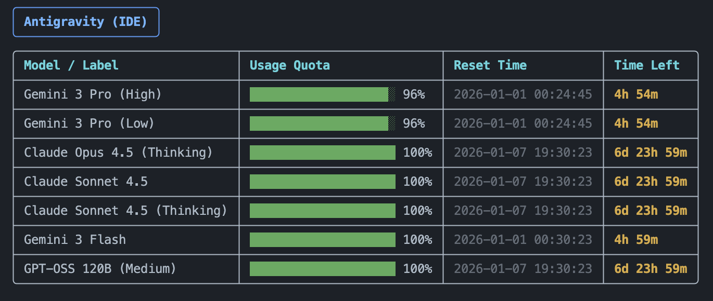

# Antigravity Usage Monitor

A monitoring script designed for **local use** to track usage quotas for Antigravity (Google's AI IDE) and Gemini API with a beautiful terminal UI. It works by inspecting local processes and configuration files on your machine.


## Features

- **Visual Dashboard**: Uses `rich` to display quotas with progress bars and color coding.
- **Quota Tracking**: Monitors remaining usage for various models (Claude, Gemini, GPT-OSS).
- **Time Remaining**: Calculates and displays exactly how much time is left until the daily quota resets.
- **Local Time**: Automatically converts reset times to your local timezone.

## Installation & Setup

This project requires **Python 3.10** or higher.
It uses [`uv`](https://github.com/astral-sh/uv) for fast dependency management.

### 1. Install `uv`
If you don't have it yet:
```bash
pip install uv
# OR via Homebrew
brew install uv
```

### 2. Create Virtual Environment
Create a new environment (defaults to `.venv`):
```bash
uv venv
```
*Note: To specify a Python version, use `uv venv --python 3.12`*

### 3. Activate Environment
```bash
source .venv/bin/activate
```

### 4. Install Dependencies
Install all required packages from `requirements.txt`:
```bash
uv pip install -r requirements.txt
```

## Usage

Simply run the script to see the dashboard:
```bash
python main.py
```

### Configuration

To check only a specific provider, use the `--provider` argument:

```bash
# Check both providers (default)
python main.py

# Check only Antigravity
python main.py --provider antigravity

# Check only Gemini CLI
python main.py --provider gemini_cli
```

## Example Output


