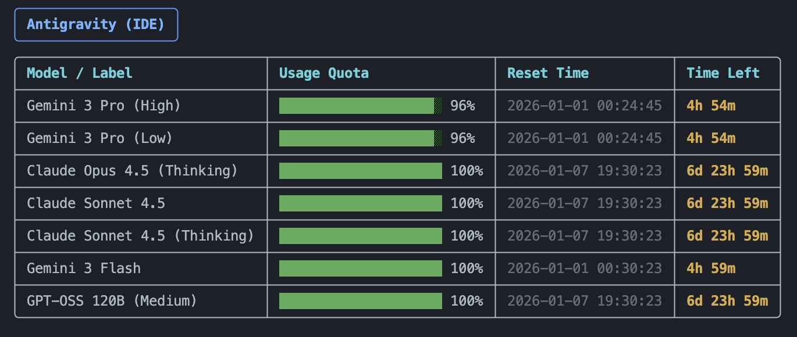

# AI Usage Monitor

A local monitoring script to track usage quotas for AI providers with a terminal dashboard.  
The codebase now uses a provider registry, so new providers can be added as isolated adapters.


## Features

- **Provider Registry**: Providers are loaded through a unified registry/collector flow.
- **Normalized Data Model**: All providers return the same quota snapshot format.
- **Visual Dashboard**: Uses `rich` to display progress bars and reset timers.
- **JSON Export**: `--format json` for automation and widget/back-end integration.

## Installation & Setup

This project requires **Python 3.10** or higher.
It uses [`uv`](https://github.com/astral-sh/uv) for fast dependency management.

### 1. Install `uv`
If you don't have it yet:
```bash
pip install uv
# OR via Homebrew
brew install uv
```

### 2. Create Virtual Environment
Create a new environment (defaults to `.venv`):
```bash
uv venv
```
*Note: To specify a Python version, use `uv venv --python 3.12`*

### 3. Activate Environment
```bash
source .venv/bin/activate
```

### 4. Install Dependencies
Install all required packages from `requirements.txt`:
```bash
uv pip install -r requirements.txt
```

## Usage

Simply run the script to see the dashboard:
```bash
python main.py
```

### Provider Selection

Use `--provider` to limit checks to one provider:

```bash
# Check both providers (default)
python main.py

# Check only Antigravity
python main.py --provider antigravity

# Check only Gemini (gemini_cli alias is still supported)
python main.py --provider gemini

# Check ChatGPT (codex alias is also supported)
python main.py --provider chatgpt

# Check Windsurf
python main.py --provider windsurf

# Check Amp
python main.py --provider amp
```

### Output Formats
```bash
# Rich terminal output (default)
python main.py --format rich

# Machine-readable output
python main.py --format json
```

### Add a New Provider
1. Copy `providers/_template.py`.
2. Implement `collect()` and return normalized `QuotaItem` objects.
3. Register the class in `providers/registry.py`.

Optional CLI path env vars for new providers:
- `WINDSURF_CLI_PATH` (default: `windsurf`)
- `AMP_CLI_PATH` (default: `amp`)

Provider auth env vars:
- `CHATGPT_ACCESS_TOKEN` (or `OPENAI_SESSION_TOKEN`, `CHATGPT_TOKEN`)
- `AMP_USAGE_ENDPOINT` + `AMP_AUTH_TOKEN` (API fallback when Amp CLI is unavailable)

## Example Output


